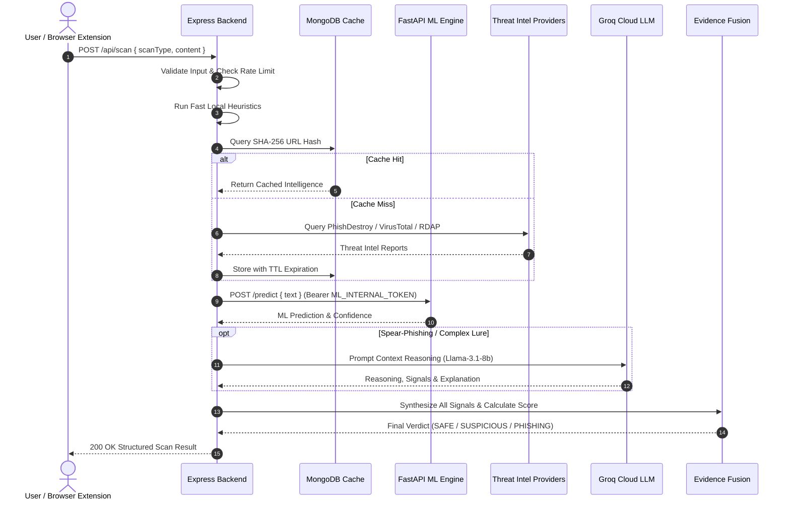
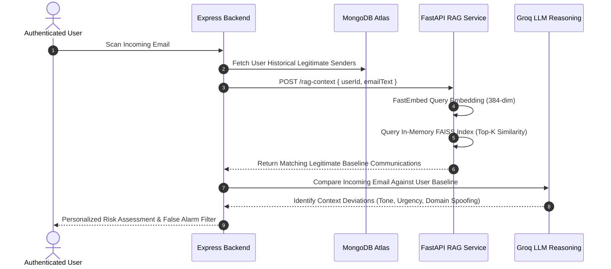

# DetectIQ — Technical Architecture Specification

```
                                  +------------------------------------+
                                  |            CLIENT LAYER            |
                                  | React 19 SPA   |   MV3 Extension   |
                                  +-----------------+------------------+
                                                    | HTTPS
                                                    v
+---------------------------------------------------------------------------------------------------+
│                             API GATEWAY & BACKEND (Node.js / Express)                             │
│                                                                                                   │
│  [Helmet Security]        [Strict CORS Origin]     [Multi-Tier Rate Limiter]                      │
│  [JWT & Cookie Guard]     [Input Sanitization]     [Evidence Fusion Engine]                       │
+-----------------┬───────────────────────────────┬──────────────────────────────┬──────────────────+
                  | Bearer ML_INTERNAL_TOKEN      | Mongoose Pool                | HTTPS (TLS 1.3)
                  v                               v                              v
+------------------------------------+  +--------------------+  +-----------------------------------+
|        AI / ML MICROSERVICE        |  |   MONGODB ATLAS    |  |     EXTERNAL THREAT INTEL         |
|         (Python / FastAPI)         |  |  (Replica Cluster) |  | • Groq Cloud LLM                  |
| • TF-IDF + Logistic Regression     |  | • Users            |  | • PhishDestroy API                |
| • FastEmbed Embeddings (384-dim)   |  | • Scans & History  |  | • VirusTotal / URLhaus / AbuseIPDB|
| • In-Memory Per-User FAISS RAG     |  | • ThreatIntelCache |  | • AlienVault OTX / GeoIP / RDAP   |
+------------------------------------+  +--------------------+  +-----------------------------------+
```

---

## 1. Architectural Layers & System Boundaries

### 1.1 Client Presentation Layer
1. **React 19 SPA (Vercel)**:
   - Interactive cybersecurity operations dashboard with light/dark adaptive UI.
   - Vite 8 build pipeline with code splitting and zero-refresh SPA routing (`vercel.json`).
   - Integrated floating toast alert notification center (`Notification.jsx`).
2. **Browser Extension (Manifest V3)**:
   - Direct web protection for Chrome, Edge, and Brave browsers.
   - Background service worker managing toolbar badge states (`SAFE`, `WARN`, `RISK`, `CRIT`).
   - Ambient pre-navigation interceptor redirecting high-risk typosquatting sites to `blocked.html`.
   - Shadow-DOM isolated content script injecting hover link shields, credential phishing banners, and webmail protection.

### 1.2 Application Gateway & Orchestration Layer (Node.js / Express)
- **Role**: Primary business logic, access control, database transactional integrity, and threat orchestration.
- **Security Middleware**:
  - `helmet`: Sets strict security headers.
  - `cors`: Locks down API access to trusted frontend domain, local Vite dev servers, and extension origins (`chrome-extension://*`, `moz-extension://*`).
  - `rateLimiter`: Tiered rate limiting across global API, authentication, and threat scanning endpoints.
- **Evidence Fusion Engine**: Deterministically synthesizes heuristic, ML, threat intelligence, and RAG signals into a unified threat verdict and numerical risk score (`0 - 100`).

### 1.3 AI / Machine Learning Microservice (Python / FastAPI)
- **Role**: High-speed text feature extraction, supervised ML classification, dense embedding generation, and vector similarity search.
- **Stack**: Python 3.10, FastAPI, Uvicorn, Scikit-Learn, FastEmbed (`all-MiniLM-L6-v2`), FAISS (Facebook AI Similarity Search).
- **Service Isolation**: Communicates strictly with the Express backend using a shared-secret internal token (`ML_INTERNAL_TOKEN`).

### 1.4 Persistence & Threat Intelligence Layer
- **MongoDB Atlas**:
  - Managed replica set cluster storing users, scan logs, learning curriculum, and forensic reports.
  - TTL collections (`ThreatIntelCache`) with automated expiration indices (`expireAfterSeconds: 0`).
- **External Threat Intelligence**:
  - Live reputation lookups across PhishDestroy, VirusTotal, AbuseIPDB, URLhaus, AlienVault OTX, and RDAP registrars.
  - Groq Cloud LLM (`llama-3.1-8b-instant`) for contextual reasoning on spear-phishing lures.

---

## 2. Core Execution Flows

### 2.1 Threat Scan Execution Flow


---

### 2.2 Personalized FAISS RAG Retrieval Flow


---

## 3. Empirical Performance Benchmarks

DetectIQ was rigorously benchmarked across real-world datasets:

| Detection Channel | Dataset / Corpus Size | Test Split ($N$) | Accuracy | Precision | Recall | F1-Score | FPR | Specificity |
| :--- | :--- | :---: | :---: | :---: | :---: | :---: | :---: | :---: |
| **Email (Without RAG)** | 500 Email Corpus | 200 | 95.00% | 91.67% | 99.00% | 95.19% | 9.00% | 91.00% |
| **Email (With RAG — DetectIQ)** | 500 Email Corpus | 200 | **99.00%** | **99.00%** | **99.00%** | **99.00%** | **1.00%** | **99.00%** |
| **Email Standalone ML** | 17,537 Emails (`phishing_dataset.csv`) | 3,508 | **98.80%** | **97.82%** | **99.01%** | **98.41%** | **1.32%** | **98.68%** |
| **URL Phishing Engine** | 100,000 URLs (`url_dataset.csv`) | 20,000 | **99.60%** | **99.96%** | **99.24%** | **99.60%** | **0.04%** | **99.96%** |
| **SMS Smishing Engine** | 5,572 Messages (`message_dataset.csv`) | 1,034 | **98.55%** | **96.77%** | **91.60%** | **94.12%** | **0.44%** | **99.56%** |

> **Impact of Personalized RAG Memory**: Integrating personalized FAISS vector retrieval reduced False Positive Rate (FPR) from **9.00% to 1.00%** (an **88.89% relative reduction in false alarms**) while increasing overall detection accuracy from **95.00% to 99.00%**.
